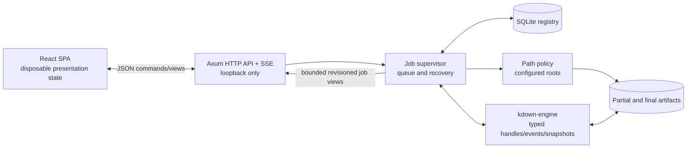

# KDown Local Web UI Design

**Status:** Draft for written-spec review  
**Date:** 2026-09-29  
**Target:** First Linux release

## 1. Intent

KDown will gain a polished local web application for everyday download management. The application is for one trusted Linux user on the same machine as the service. Downloads continue when the browser closes and recover safely after a service restart.

The existing `kdown-engine` crate remains a library. A new Rust application host owns durable jobs, filesystem policy, API behavior, and engine lifecycles. A React/TypeScript single-page application provides the user interface.

The first release is an essentials-first manager, not an interface for every engine option. It must make the common path excellent while preserving boundaries that allow advanced engine controls later.

## 2. Success Criteria

The release succeeds when a user can:

1. Start KDown locally and open the UI in a current Firefox or Chromium browser.
2. Confirm or configure at least one allowed download root.
3. Add an HTTP or HTTPS URL and choose an allowed root and safe relative destination.
4. Observe trustworthy state, bytes, progress, ETA, effective rate, wire rate, and warnings.
5. Pause, resume, cancel, and retry when those actions are valid.
6. Close and reopen the browser without affecting active downloads.
7. Restart the service during a resumable transfer and see it recover automatically.
8. Understand validation, transfer, persistence, and recovery failures without inspecting logs.
9. Search and filter durable completion, cancellation, and failure history.
10. Operate the primary flows with keyboard and screen-reader semantics.

No accepted UI command may create a job outside an allowed root, and no history action may delete a completed file.

## 3. Scope

### 3.1 First release

- Local single-user service bound to loopback.
- First-run allowed-root setup with a suggested XDG Downloads directory when available.
- Single-URL HTTP and HTTPS jobs.
- Persistent queue and terminal history.
- New download, job detail, history, and settings surfaces.
- Pause, resume, cancel, retry, reveal in folder, and remove-history actions.
- Live engine lifecycle, progress, ETA, useful/wire rate, warning, retry, and failure presentation.
- Configured roots, default destination, global active-job concurrency, global rate limit, and manual-launch browser behavior settings.
- Browser completion/failure notifications while the UI is open and permission has been granted.
- Ocean Precision visual system, responsive layout, keyboard support, reduced-motion support, and WCAG AA contrast.
- Linux-first documentation and a disabled-by-default user-level systemd unit in the release bundle.

### 3.2 Explicitly out of scope

- Accounts, authentication screens, tenancy, or LAN/Internet exposure.
- Scheduled starts, priorities, tags, batch import, or reusable profiles.
- Per-job proxy, TLS, authentication, arbitrary-header, integrity, or segment tuning UI.
- Directory/site crawling UI.
- Background desktop notifications while no browser is connected.
- Deleting completed files from history.
- Native desktop shell or native folder-picker integration.
- macOS or Windows packaging and OS integration.

These exclusions define the first release; they are not compatibility promises for future releases.

## 4. Architecture

### 4.1 Repository layout

- `crates/engine`: existing `kdown-engine` library; no web, database, or UI responsibilities.
- `crates/app`: new `kdown-app` binary crate containing the HTTP server, job supervisor, persistence, path policy, asset serving, and Linux integration.
- `web`: React/TypeScript/Vite application and generated API types.
- `docs`: user installation, configuration, operation, recovery, and API documentation.

The root workspace adds `crates/app` as a member. The engine remains independently consumable.

### 4.2 Runtime ownership

The Rust host is the only durable authority. It owns:

- Engine controllers, handles, tasks, and shutdown.
- Queue admission and global limits.
- Job intent, desired lifecycle state, attempt history, and settings.
- Allowed-root and destination validation.
- API and SSE connections.

The browser owns only disposable presentation state: selected tabs, open dialogs, form drafts, filters, and cached server views. Closing or reconnecting the browser cannot change a job.

### 4.3 Technology choices

The host uses Tokio, Axum, Serde, SQLx with SQLite, and tracing. SQLx runtime queries avoid a build-time database requirement. Database migrations ship in the binary and run before the server accepts mutations.

The frontend uses React, TypeScript, Vite, React Router, and TanStack Query. Radix Primitives provide dialogs, menus, tooltips, and switches; other components remain local. Styling uses semantic CSS custom properties and focused component styles rather than a second visual framework. Host DTOs derive an OpenAPI document with Utoipa, and `openapi-typescript` generates frontend API types from that document so the Rust contract remains the source of truth.

Development runs Vite with an API/SSE proxy to the Rust host. A packaged release builds `web/dist` first and compiles those assets into `kdown-app` behind a release-only bundled-assets feature. Normal `kdown-engine` builds do not require Node.js.

## 5. Host Components

### 5.1 HTTP API

The API is versioned under `/api/v1`. It exposes:

- Session/bootstrap data, build identity, and CSRF token.
- Paginated job collection and one-job detail views.
- Job creation and explicit pause, resume, cancel, retry, and remove-history commands.
- Allowed-root and settings reads/updates.
- An SSE stream for revisioned live job views and service health changes.
- A health endpoint for local diagnostics and service management.

Mutations use explicit action routes rather than a generic state setter. Each mutation includes the last observed persisted `control_version`; stale or illegal commands return a conflict with the current job view.

### 5.2 Job supervisor

The supervisor is the sole adapter between application jobs and `kdown-engine` runs. It:

- Admits persisted jobs subject to global concurrency.
- Creates `EngineConfig`, `HttpTransport`, `DownloadController`, and request values from validated application intent.
- Owns live handles and maps legal application commands to engine controls.
- Samples authoritative engine snapshots at no more than 4 Hz per active job and immediately on lifecycle milestones.
- Writes durable milestones and terminal results without writing every telemetry sample to SQLite.
- Starts new attempts for explicit retry and service recovery.
- Stops active runs on graceful service shutdown while preserving resumable artifacts and keeping user intent distinct from user cancellation.

App-level `Queued` and `Recovering` states wrap the engine's existing lifecycle. The UI otherwise displays engine lifecycle states without inventing optimistic transitions.

### 5.3 Registry

SQLite uses WAL mode, foreign keys, and transactional migrations. The default database location follows XDG state directories, normally `$XDG_STATE_HOME/kdown/kdown.db` or `~/.local/state/kdown/kdown.db`.

Core entities:

- `jobs`: source URL, root ID, safe relative destination, conflict/resume policy, desired state, last durable status, persisted control version, current attempt, and timestamps.
- `attempts`: initial/retry/recovery reason, start/end times, terminal outcome, typed failure summary, and final metrics.
- `roots`: user-facing label, canonical absolute directory, enabled/default flags, and timestamps.
- `settings`: typed global concurrency, global rate limit, default root, notification preference, and startup preference.

The full normalized URL is persisted because restart recovery and retry require it. URL user-info credentials are rejected. Query strings are retained in the local database because signed download URLs depend on them, but logs and generic errors omit query strings and fragments. The UI shows origin plus path by default and reveals the full URL only on explicit user action.

### 5.4 Path policy

Ordinary job requests submit a root ID and a relative destination, never an absolute destination. Root-management requests may submit an absolute existing directory because adding a root is itself the explicit authorization step.

The host:

- Canonicalizes each configured root.
- Rejects absolute job-relative paths, parent traversal, NULs, invalid filename components, and disabled roots.
- Resolves existing symlink components and rejects destinations that escape the canonical root.
- Creates any requested subdirectory before engine startup, canonicalizes the resulting parent, verifies that it remains under the configured root, and only then constructs the engine request.
- Uses opaque root IDs in all job views and commands.
- Invokes `xdg-open` without a shell to reveal a completed file's parent directory.

The local user remains the filesystem trust boundary: a user who can modify a root concurrently can also modify its files directly. The host still prevents browser input and application bugs from escaping configured roots.

### 5.5 Static assets and process lifecycle

The production binary serves embedded, content-hashed frontend assets and falls back to `index.html` only for known SPA navigation routes. API paths never receive the SPA fallback.

`kdown-app serve` starts the loopback service. An `--open` option opens the browser after health readiness. The release bundle includes a user-level systemd unit in a disabled state; enabling it is an explicit user action documented outside the UI. Service shutdown drains persistence work, stops engine runs with resumable artifacts preserved, and closes the database cleanly.

## 6. Frontend Experience

### 6.1 Navigation and responsive structure

Primary navigation contains Downloads, History, and Settings.

- At 1024 px and wider: persistent compact left rail and main workspace.
- From 640 px through 1023 px: icon rail with labeled tooltips.
- Below 640 px: bottom navigation; drawers become full-screen sheets.

The dashboard is the default route. Job detail has a stable URL so a browser refresh or copied local link restores the same view.

### 6.2 Dashboard

The dashboard shows:

- Aggregate effective download rate.
- Active and queued counts.
- Data completed today.
- Active/queued job cards ordered by active state and creation time.
- Recent terminal jobs.
- A prominent New Download action.

Each job card shows filename or pending resolved name, lifecycle label, progress, transferred/total bytes when known, useful rate, ETA when meaningful, and only currently legal controls. State is always represented by text/icon as well as color.

### 6.3 New Download drawer

The default form contains:

- URL.
- Allowed destination root.
- Optional safe subfolder.
- Optional filename override.
- Conflict behavior using clear user terms mapped to engine overwrite/resume policy.

The host is authoritative for validation. Client validation exists only for immediate field guidance. Submitting persists intent before engine startup; the new job appears immediately in Created or Queued state.

### 6.4 Job detail

Job detail presents:

- Lifecycle state and state-specific guidance.
- Progress, byte counts, effective/wire rates, ETA, and elapsed time.
- Current retry, warning, destination, protocol/connection, and concurrency details that already exist in the engine snapshot.
- Compact recent rate history kept only in browser memory.
- Valid pause, resume, cancel, retry, reveal, and remove-history actions.
- Expandable safe technical detail for typed failures.

Cancel opens a confirmation dialog. Preserving resumable partial data is the default. Discarding partial data is a separate destructive selection with explicit wording. Remove history is available only for terminal jobs and deletes database records, never files.

### 6.5 History

History is paginated and filterable by completed, failed, cancelled, source text, filename, and date. Rows link to durable job/attempt details. Retry creates a new attempt under the same job so prior failure context remains visible.

The UI virtualizes or incrementally renders large lists and remains interactive with 10,000 history rows.

### 6.6 Settings and first run

If no root exists, the app opens a blocking first-run setup surface. It suggests the XDG Downloads directory when present; the user must confirm it or enter another existing absolute directory. Normal download forms become available only after at least one enabled root exists.

Settings manage roots, default root, global active-download concurrency, global rate limit, browser notification preference, and whether an interactive manual launch opens the browser. The systemd unit always starts with browser opening disabled. Removing or disabling a root is rejected while a nonterminal job references it.

### 6.7 Ocean Precision visual system

Ocean Precision is the only theme in this release; no theme toggle is shown:

- Deep navy page background (`#07111f`).
- Raised navy surfaces (`#101f32`).
- Structured borders (`#1b304a`).
- Mint primary action and active status (`#3be0c5`).
- Cool blue secondary data accent (`#68a7ff`).
- High-contrast primary text (`#e9f2ff`) and quieter slate text.
- Amber warnings and coral failures that meet AA contrast against their surfaces.

The design uses restrained depth, 8–18 px radii by component scale, tabular numerals for telemetry, and sparse motion only for meaningful state changes. It honors `prefers-reduced-motion`. Focus rings are always visible. Color never carries status alone.

## 7. Data and Event Flow

### 7.1 Create and command flow

1. The browser sends a typed request with its CSRF token.
2. The host validates session, URL, lifecycle precondition, root, relative path, and settings.
3. A transaction persists intent and increments `control_version`.
4. The supervisor starts or controls the engine.
5. The command response returns the current durable job view.
6. Engine snapshots and milestones produce revisioned SSE job views.
7. The client applies a view only when its attempt ID and sample sequence are newer than the cached view.

The UI may show a pending command affordance, but it does not display the requested lifecycle as achieved until the host/engine view reports it.

### 7.2 Revision model

Two values have separate purposes:

- `control_version`: durable integer incremented by accepted user mutations and durable lifecycle milestones; used for mutation conflict detection.
- `sample_seq`: in-memory monotonic sequence within one attempt; used to order telemetry snapshots without persisting at 4 Hz.

A new attempt gets a new attempt ID and resets `sample_seq`. A service restart therefore cannot make an old browser sample look newer than recovered state.

### 7.3 SSE behavior

The SSE stream emits:

- `hello`: service epoch, build identity, and stream policy.
- `job.snapshot`: complete display-safe view for one active or recently changed job.
- `job.removed`: terminal history record removed.
- `settings.changed`: settings/root invalidation.
- `service.degraded`: database or supervisor health requiring a persistent banner.

The host does not retain an unbounded replay log. On every initial connection and reconnect, the browser opens SSE, receives `hello`, buffers subsequent events, fetches authoritative active-job and visible-history collections, replaces its cache, then applies buffered views that are newer by attempt ID and `sample_seq`. Controls remain disabled until this handshake completes, and cached data stays visibly stale while disconnected.

## 8. Restart Recovery

On startup, the supervisor loads every nonterminal job and its desired state.

1. Revalidate the referenced enabled root and canonical destination.
2. Inspect the partial artifact using the engine's existing resume policy and metadata rules.
3. Leave user-paused jobs paused.
4. Leave user-cancelled jobs terminal.
5. Put jobs whose desired state is running into app-level Recovering.
6. Create one recovery attempt and start the engine with safe resume enabled.
7. Publish the new attempt view.

If safe resume is impossible, the job becomes Failed with a typed recovery reason. The partial artifact is preserved. The UI explains whether the user can retry from scratch, choose a different destination, or correct root access.

A graceful service stop and a process crash have the same durable recovery semantics. Graceful shutdown additionally stops active engine work cleanly and flushes pending milestone writes.

## 9. Security and Error Handling

### 9.1 Local HTTP boundary

Loopback binding is not treated as sufficient protection by itself.

- Only expected loopback `Host` values are accepted.
- UI and API share one origin; CORS is disabled.
- Session bootstrap returns a random per-process CSRF token readable only by same-origin JavaScript.
- Every mutation requires JSON, the CSRF header, a same-origin `Origin`, and acceptable Fetch Metadata.
- Responses set a restrictive Content Security Policy and related browser hardening headers.
- API responses containing session/bootstrap data use `Cache-Control: no-store`.

### 9.2 Error contract

All non-success API responses use a stable envelope:

- `code`: machine-stable identifier.
- `message`: concise, safe user-facing summary.
- `retryable`: whether repeating the operation can reasonably succeed unchanged.
- `field_errors`: optional per-field validation map.
- `current_job`: optional current view for lifecycle/version conflicts.
- `detail`: optional redacted technical context.

Validation or persistence failure occurs before engine startup, preventing ghost jobs. Database write failure rejects new mutations and starts no new engine work. Existing work may finish, but the service enters a degraded state until its terminal result can be durably recorded.

Engine retry exhaustion creates a durable failed attempt. Unsafe recovery fails closed and preserves artifacts. Global failures use a persistent banner; job failures remain attached to the job. Transient toasts acknowledge successful commands but never carry the only copy of an error.

Secrets, authorization values, URL credentials, proxy credentials, CSRF tokens, and unnecessary absolute paths are excluded from logs and browser error detail.

## 10. Accessibility and Interaction Requirements

- Semantic landmarks, headings, lists, tables, forms, and buttons.
- Full keyboard navigation with logical focus order and focus restoration after drawers/dialogs.
- Dialog focus trapping and Escape behavior that never discards a destructive confirmation silently.
- Accessible names for icon-only controls.
- Live regions for lifecycle changes, not for every progress sample.
- AA text/control contrast, visible focus, non-color status cues, and 44 px touch targets on narrow layouts.
- Progress components expose current value and indeterminate state correctly.
- Motion respects reduced-motion preference; no essential information depends on animation.

## 11. Verification Strategy

### 11.1 Host integration coverage

Use temporary SQLite databases, temporary allowed roots, and the repository's process-isolated HTTP fixture to verify:

- Intent is durable before an engine run begins.
- Only legal revision/lifecycle commands are accepted.
- Traversal and symlink escape fail while valid nested destinations succeed.
- Active transfer restart produces one recovery attempt and a correct final artifact.
- Paused and cancelled jobs preserve their state after restart.
- Retry preserves prior attempt history.
- Persistence failure prevents new work from starting.
- Graceful shutdown preserves resumable artifacts without converting user intent to cancellation.

### 11.2 API and stream coverage

Exercise the real Axum router:

- Same-origin bootstrap and CSRF enforcement.
- Stable validation/conflict/error envelopes.
- Bounded snapshot cadence under rapid engine events.
- Disconnect/reconnect followed by authoritative collection reconciliation.
- `control_version`, attempt ID, and `sample_seq` ordering.
- SPA fallback never masks API 404 responses.

### 11.3 Frontend behavioral coverage

Permanent frontend tests remain narrow and behavior-focused:

- New-download validation and server field errors.
- Legal controls for representative lifecycle states.
- Disconnected/stale lockout and successful reconciliation.
- Typed failure guidance and destructive cancellation confirmation.
- Keyboard/focus behavior for the drawer, dialog, and job controls.

Tests that merely assert copied API strings, component forwarding, or mock echoes are excluded.

### 11.4 End-to-end acceptance run

Build and embed production assets, launch the real binary, and drive the UI in a real browser:

1. Add and complete a small download; verify bytes and durable history.
2. Pause and resume a throttled transfer.
3. Restart the service mid-transfer; verify automatic safe recovery and final content.
4. Cancel once preserving and once discarding partial data.
5. Reject a destination outside configured roots.
6. Exercise a typed transfer failure and retry.
7. Reload and reconnect the browser during active work.
8. Verify desktop and narrow responsive surfaces, keyboard operation, and an accessibility audit.

The run must show no uncaught browser errors or failed unexpected API requests.

### 11.5 Operational budgets

- No more than 4 UI snapshot updates per second per active job.
- Smooth controls with 8 active jobs and 10,000 history records.
- Bounded host broadcast buffers and no unbounded browser event retention.
- Telemetry sampling does not produce per-sample SQLite writes.

## 12. Documentation and Delivery

Implementation updates must include:

- Root README instructions for building and running the local application.
- Linux service/startup documentation, including explicit systemd user-unit enablement.
- Allowed-root, artifact, cancellation, and recovery behavior.
- Security statement that the service is loopback-only and unsupported for remote exposure.
- Changelog entry for the application host and UI.
- OpenAPI artifact or generation command for frontend/API development.

The release artifact is the `kdown-app` binary with embedded frontend assets plus optional Linux service metadata. The library package remains independently buildable and documented.

## 13. Acceptance Criteria

The design is implemented only when all of the following hold:

- The packaged host serves the Ocean Precision UI from loopback.
- A user can complete every first-release workflow without CLI intervention after first launch.
- Browser closure has no effect on active jobs.
- Service restart safely recovers a resumable active job.
- UI state reconciles after SSE loss without stale commands succeeding.
- Every job artifact remains under an enabled configured root.
- History removal cannot delete a completed artifact.
- Typed failures remain inspectable after restart.
- Primary workflows meet the accessibility requirements.
- The end-to-end acceptance run and affected engine/application checks pass.
